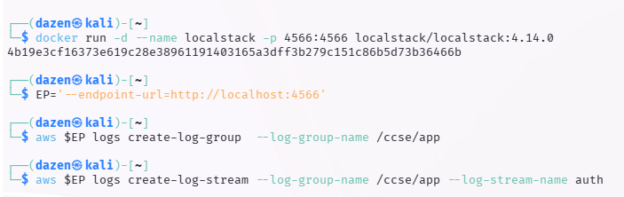

# Lab 5: CloudWatch Logging, Threat Analysis, Cryptographic Log Integrity & Active Mitigation

## Student & Course Information

| Field | Details |
| :--- | :--- |
| **Student Name** | Muhammad Danish | 
| **College / University** | University of Kuala Lumpur |
| **Course / Subject** | IKB42603 & Cloud Computing Security Essentials |
| **Lecturer / Instructor** | Nor Adani Kamal Mohammad Nasir |
| **Date of Submission** | September 4, 2026 |

---

## Overview

This lab activity establishes a complete end-to-end security operational workflow starting with the initialization of a LocalStack container to emulate AWS CloudWatch Logs service (`/ccse/app` log group and `auth` log stream). Standard authentication logs (`auth.log`) are generated and ingested into CloudWatch, followed by Linux CLI analysis (`grep`, `awk`, `sort`, `uniq`) to identify brute-force login attempts originating from malicious source IP addresses. To guarantee log immutability and detect data tampering, a SHA-256 forward-linked cryptographic hash chain (`auth.chain`) is implemented. Automated incident correlation rules are evaluated to detect complex multi-stage attack patterns—linking failed authentication attempts to successful system compromise and subsequent 500MB data exfiltration. Finally, active network mitigation is enforced by dynamically dropping malicious traffic via `iptables` inside a Linux container environment, culminating in forensic evidence preservation verified through SHA-256 checksums (`evidence.sha256`).

---

## 1. Environment Setup

### 1.1 LocalStack Container Initialization
Deploy LocalStack in detached mode mapping AWS API endpoint port `4566`.

```bash
docker run -d --name localstack -p 4566:4566 localstack/localstack:4.14.0
```

### 1.2 Environment & CloudWatch Log Resource Configuration
Set custom endpoint shortcut and initialize AWS CloudWatch Log Group and Stream.

```bash
EP='--endpoint-url=http://localhost:4566'

# Create Log Group
aws $EP logs create-log-group --log-group-name /ccse/app

# Create Log Stream
aws $EP logs create-log-stream --log-group-name /ccse/app --log-stream-name auth
```

**Screenshot Evidence:**


---

## 2. Lab Tasks & Execution

### Task 1: Log Data Generation (`auth.log`)
Generate realistic authentication logs containing normal user login, brute-force login attempts, account compromise, and unauthorized data export.

```bash
cat > auth.log <<'EOF'
2025-03-01T09:00:01 LOGIN_OK   user=ahmad  ip=10.0.0.5
2025-03-01T09:01:10 LOGIN_FAIL user=admin  ip=203.0.113.9
2025-03-01T09:01:12 LOGIN_FAIL user=admin  ip=203.0.113.9
2025-03-01T09:01:15 LOGIN_FAIL user=admin  ip=203.0.113.9
2025-03-01T09:01:18 LOGIN_FAIL user=admin  ip=203.0.113.9
2025-03-01T09:01:22 LOGIN_OK   user=admin  ip=203.0.113.9
2025-03-01T09:01:40 EXPORT_DATA user=admin ip=203.0.113.9 size=500MB
EOF

cat auth.log
```

**Screenshot Evidence:**


---

### Task 2: CloudWatch Log Event Ingestion & Retrieval
Iterate through local log lines and push events into LocalStack CloudWatch Logs with incrementing timestamps.

```bash
TS=$(date +%s000)
while IFS= read -r line; do
  aws $EP logs put-log-events --log-group-name /ccse/app --log-stream-name auth \
  --log-events timestamp=$TS,message="$line" >/dev/null; TS=$((TS+1000));
done < auth.log

aws $EP logs get-log-events --log-group-name /ccse/app --log-stream-name auth \
--query 'events[].message' --output text
```

**Screenshot Evidence:**


---

### Task 3: Analyzing Failed Logins by Attacker IP
Extract and count occurrences of `LOGIN_FAIL` grouped by source IP address.

```bash
grep LOGIN_FAIL auth.log | awk '{print $4, $5}' | sort | uniq -c
```

**Screenshot Evidence:**


---

### Task 4: Cryptographic Log Hash Chaining & Tamper Detection
Implement a blockchain-like log integrity hash chain where each hash includes the previous log entry's cumulative hash value.

```bash
PREV=0
while IFS= read -r line; do
  PREV=$(printf '%s%s' "$PREV" "$line" | sha256sum | cut -d' ' -f1)
  printf '%s | %s\n' "$line" "$PREV"
done < auth.log > auth.chain

cat auth.chain

sed 's/500MB/5MB/' auth.log > auth.tampered

PREV=0; BROKE=no
paste -d'|' <(cut -d'|' -f1 auth.chain) <(cut -d'|' -f2 auth.chain) >/dev/null
```

**Screenshot Evidence:**


---

### Task 5: Incident Correlation & Rule-Based Alerting
Correlate events for suspicious IP `203.0.113.9` and trigger an automated security alert if failure threshold and exfiltration indicators are satisfied.

```bash
IP=203.0.113.9
FAILS=$(grep -c "LOGIN_FAIL.*$IP" auth.log)
SUCCESS=$(grep -c "LOGIN_OK.*$IP" auth.log)
EXPORT=$(grep -c "EXPORT_DATA.*$IP" auth.log)

echo "IP=$IP fails=$FAILS success=$SUCCESS export=$EXPORT"

if [ "$FAILS" -ge 3 ] && [ "$SUCCESS" -ge 1 ] && [ "$EXPORT" -ge 1 ]; then
  echo 'ALERT: probable brute-force -> compromise -> data exfiltration';
fi
```

**Screenshot Evidence:**


---

### Task 6: Active Mitigation (`iptables`) & Evidence Hash Preservation

**1. Apply Network Level IP Block via Container Capabilities & Preserve Evidence Log:**

```bash
docker run --rm --cap-add=NET_ADMIN alpine sh -c \
'apk add -q iptables; iptables -A INPUT -s 203.0.113.9 -j DROP; iptables -L INPUT -n | tail -2'

cp auth.log evidence_$(date +%Y%m%d).log
sha256sum evidence_*.log > evidence.sha256
cat evidence.sha256
```

**Screenshot Evidence:**


---

## 3. Post-Task Verification

### 3.1 Verify CloudWatch Log Group & Hash Integrity
Verify CloudWatch log group description and validate cryptographic evidence checksum.

```bash
aws --endpoint-url=http://localhost:4566 logs describe-log-groups
sha256sum -c evidence.sha256
```

**Screenshot Evidence:**


---

## 4. Teardown & Environment Cleanup

### 4.1 Environment Teardown & Container Removal
Clean up temporary files and tear down LocalStack container.

```bash
rm -f auth.log auth.chain auth.tampered evidence_*.log evidence.sha256
docker stop localstack && docker rm localstack
```

**Screenshot Evidence:**


---

## 5. Lab Review & Analytical Questions

### Q1: What is LocalStack, and why is it used in this lab activity?
**Answer:**  
LocalStack is an open-source cloud service emulator that runs inside Docker. In this lab, LocalStack emulates AWS CloudWatch Logs locally on port `4566`. This enables security analysts and developers to construct, test, and validate AWS CLI commands, log streams, and monitoring workflows locally without requiring active AWS Cloud subscriptions or incurring service costs.

---

### Q2: What is the difference between a CloudWatch Log Group and a CloudWatch Log Stream?
**Answer:**  
- **Log Group**: A logical container that defines common retention policies, metric filters, and access controls for related logs (e.g., `/ccse/app`).
- **Log Stream**: A sequence of log events originating from a specific source, host, or application process instance within a Log Group (e.g., `auth`).

---

### Q3: How was the attacker IP address identified during log analysis in Task 3?
**Answer:**  
Using the Linux text processing pipeline:
```bash
grep LOGIN_FAIL auth.log | awk '{print $4, $5}' | sort | uniq -c
```
- `grep LOGIN_FAIL`: Filters lines containing failed authentication attempts.
- `awk '{print $4, $5}'`: Extracts the username (`user=admin`) and source IP (`ip=203.0.113.9`).
- `sort | uniq -c`: Aggregates and counts frequencies. The output clearly identified `4` failed login attempts originating from `203.0.113.9`.

---

### Q4: Explain the concept of Cryptographic Hash Chaining used in Task 4 and why it protects log integrity.
**Answer:**  
Cryptographic hash chaining calculates each log line's hash using the SHA-256 algorithm by combining the current line's text with the SHA-256 digest of the preceding log entry ($H_n = \text{SHA256}(H_{n-1} + \text{Line}_n)$).  
Because cryptographic hash functions are strictly one-way and collision-resistant:
- If an adversary attempts to modify or delete a past log line (e.g., changing `500MB` to `5MB`), the modified line produces a completely different hash digest.
- This invalidates every subsequent hash in the chain.
- Auditors can recompute the chain to instantly detect tampering and pinpoint the exact line where tampering occurred.

---

### Q5: Describe the Attack Chain correlated in Task 5.
**Answer:**  
The correlation rule in Task 5 detects a multi-stage attack lifecycle:
1. **Initial Reconnaissance & Brute-Force**: 4 failed login attempts (`LOGIN_FAIL`) for user `admin` from IP `203.0.113.9`.
2. **Account Compromise**: 1 successful login (`LOGIN_OK`) for user `admin` from the same IP (`203.0.113.9`).
3. **Data Exfiltration**: 1 data export event (`EXPORT_DATA`) exporting 500MB of sensitive data.

The threshold condition `[ "$FAILS" -ge 3 ] && [ "$SUCCESS" -ge 1 ] && [ "$EXPORT" -ge 1 ]` evaluates to `true`, triggering the security alert:
`ALERT: probable brute-force -> compromise -> data exfiltration`.

---

### Q6: Why is `iptables` used in Task 6, and what is the function of the `--cap-add=NET_ADMIN` flag in Docker?
**Answer:**  
- **`iptables`**: Serves as an active network firewall mitigation tool to dynamically append a rule (`-A INPUT -s 203.0.113.9 -j DROP`) that immediately drops all incoming packets from the malicious source IP address `203.0.113.9`.
- **`--cap-add=NET_ADMIN`**: By default, Docker containers run with restricted privileges and cannot modify host kernel routing or firewall tables. Adding the `NET_ADMIN` Linux capability grants the container host network stack administration permissions to perform `iptables` operations.

---

### Q7: Why is SHA-256 hash preservation (`evidence.sha256`) necessary during digital forensic investigations?
**Answer:**  
In legal and forensic incident response, establishing the **Chain of Custody** is critical. Generating a cryptographic SHA-256 hash immediately upon capturing forensic log evidence (`evidence_YYYYMMDD.log`) creates an unalterable digital fingerprint. Verifying the checksum later (`sha256sum -c evidence.sha256`) proves to courts or auditors that the evidence has remained pristine and un-tampered with throughout the analysis.
